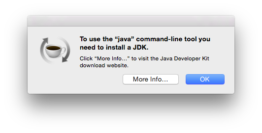

# Install `lein`

Web: http://leiningen.org

Use following commands on Mac OS X terminal:

``` bash
LEIN_SCRIPT='/usr/local/bin/lein' # Make sure it's on $PATH
LEIN_SCRIPT_URL='https://raw.githubusercontent.com/technomancy/leiningen/stable/bin/lein'
curl -fsSL --create-dirs -o $LEIN_SCRIPT $LEIN_SCRIPT_URL && chmod +x $LEIN_SCRIPT && lein
```

Alternative if the previous command doesn't work (requires you to `sudo` to modify `/usr/*`):

``` bash
LEIN_PATH=/usr/local/bin/
curl -fsSLO https://raw.githubusercontent.com/technomancy/leiningen/stable/bin/lein && \
  chmod +x lein && \
  sudo mkdir -p $LEIN_PATH && \
  sudo mv lein $LEIN_PATH && \
  lein
```
A the first launch, the script auto-installs everything required for `lein` and `clojure` to work. You should see something like the following:

```
Downloading Leiningen to /Users/rob/.lein/self-installs/leiningen-2.5.1-standalone.jar now...
  % Total    % Received % Xferd  Average Speed   Time    Time     Time  Current
                                 Dload  Upload   Total   Spent    Left  Speed
100   406    0   406    0     0    529      0 --:--:-- --:--:-- --:--:--   529
100 14.5M  100 14.5M    0     0  1093k      0  0:00:13  0:00:13 --:--:-- 1637k

Leiningen is a tool for working with Clojure projects.

Several tasks are available:
change              Rewrite project.clj by applying a function.
check               Check syntax and warn on reflection.
classpath           Print the classpath of the current project.
clean               Remove all files from project's target-path.
compile             Compile Clojure source into .class files.
deploy              Build and deploy jar to remote repository.
deps                Download all dependencies.
do                  Higher-order task to perform other tasks in succession.
help                Display a list of tasks or help for a given task.
install             Install the current project to the local repository.
jar                 Package up all the project's files into a jar file.
javac               Compile Java source files.
new                 Generate project scaffolding based on a template.
plugin              DEPRECATED. Please use the :user profile instead.
pom                 Write a pom.xml file to disk for Maven interoperability.
release             Perform :release-tasks.
repl                Start a repl session either with the current project or standalone.
retest              Run only the test namespaces which failed last time around.
run                 Run a -main function with optional command-line arguments.
search              Search remote maven repositories for matching jars.
show-profiles       List all available profiles or display one if given an argument.
test                Run the project's tests.
trampoline          Run a task without nesting the project's JVM inside Leiningen's.
uberjar             Package up the project files and dependencies into a jar file.
update-in           Perform arbitrary transformations on your project map.
upgrade             Upgrade Leiningen to specified version or latest stable.
vcs                 Interact with the version control system.
version             Print version for Leiningen and the current JVM.
with-profile        Apply the given task with the profile(s) specified.

Run `lein help $TASK` for details.

Global Options:
  -o             Run a task offline.
  -U             Run a task after forcing update of snapshots.
  -h, --help     Print this help or help for a specific task.
  -v, --version  Print Leiningen's version.

See also: readme, faq, tutorial, news, sample, profiles, deploying, gpg,
mixed-source, templates, and copying.
```

## Troubleshooting

### `java` missing

If you do not have the `java` command-line tool you will see following error message instead:

``` bash
No Java runtime present, requesting install.
```

At the same time a dialog will ask you to install the Java Developer Kit to proceed:



Click on `More Info...` and follow the instructions to install the JDK (spoiler: you will be redirected to the Oracle website). After installing the JDK verify that `java` command-line tool was properly installed, e.g.:

```
$ java -version
java version "1.8.0_45"
Java(TM) SE Runtime Environment (build 1.8.0_45-b14)
Java HotSpot(TM) 64-Bit Server VM (build 25.45-b02, mixed mode)
```

If so, you can now relaunch `lein` to proceed.

# Start a REPL

Once `lein` is installed, you can start a REPL right away with `lein repl`. Please go ahead and try it. You should see something like:

```
nREPL server started on port 58749 on host 127.0.0.1 - nrepl://127.0.0.1:58749
REPL-y 0.3.5, nREPL 0.2.6
Clojure 1.6.0
Java HotSpot(TM) 64-Bit Server VM 1.7.0_65-b17
    Docs: (doc function-name-here)
          (find-doc "part-of-name-here")
  Source: (source function-name-here)
 Javadoc: (javadoc java-object-or-class-here)
    Exit: Control+D or (exit) or (quit)
 Results: Stored in vars *1, *2, *3, an exception in *e

user=> 
```

The last line (`user=> `) is the REPL prompt waiting for your input. Be polite and say hello.

```
user=> hello

CompilerException java.lang.RuntimeException: Unable to resolve symbol: hello in this context, compiling:(NO_SOURCE_PATH:0:0) 
```

Well... at least it responds. Maybe we can be even more polite enquoting the word:

```
user=> "hello"
"hello"
```

Ok, that seems to work. Let's move on with the environment setup before we dive into `clojure` itself.

As the intruductory text of the REPL indicates, you can exit the REPL with either `Control+D`, `(exit)` or `(quit)`.


# Create a project

Starting a REPL right away as we just did is fast but lacks a bit of context. Let's setup a tiny context so that we control where things happen. For that we will create a new `lein` project with `lein new into-clojure`, where the last word is the name of the project. You will something like:

```
Generating a project called into-clojure based on the 'default' template.
The default template is intended for library projects, not applications.
To see other templates (app, plugin, etc), try `lein help new`.
```

You can now `cd into-clojure` and see that there are a couple of files set up for you.

```
$ ls -1aF
./
../
.gitignore
.lein-repl-history
LICENSE
README.md
doc/
project.clj
resources/
src/
target/
test/
```

We will look at them later, but the interesting part now is that if you start again a `lein repl` from within this project directory, the REPL will be contextualized with the project settings.

Moreover, `lein` keeps track of everything you type into the REPL in a history file proper to this project, i.e. `.lein-repl-history`.

